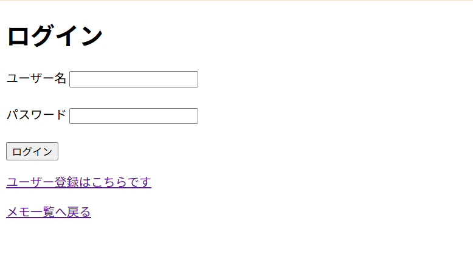
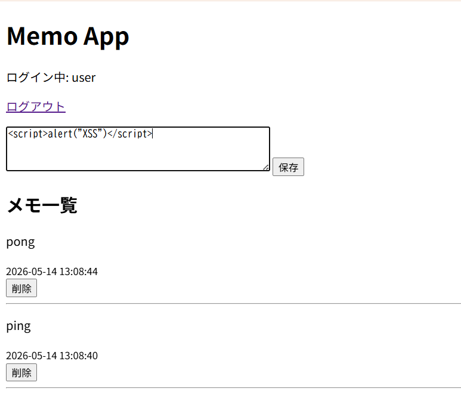
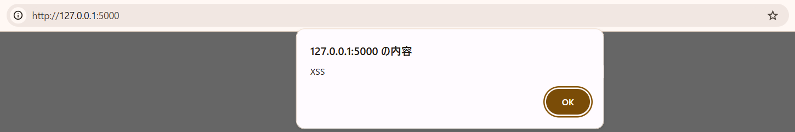

# Flask Memo App

## 概要

FlaskとSQLiteを用いて作成した簡易メモアプリです。

Webアプリケーションの基本的な構造を理解するために実装しました。

また、Webセキュリティの基礎理解を目的として、SQL Injectionと Stored XSSが発生する脆弱版の実装を用意し、安全版との違いを比較しました。


## 注意

`app_vulnerable.py`はWebセキュリティ学習用に意図的に脆弱な実装を含んでいます。
ローカル環境での検証のみを目的としており、公開サーバー上では実行しないでください。

## 実装した機能

- ユーザー登録
- パスワードのハッシュ化保存
- ログイン / ログアウト
- セッションによるログイン状態管理
- メモ投稿
- 自分のメモのみ表示
- メモ削除
- 所有者チェックによる削除制御
- SQL Injection の脆弱版実装
- Stored XSS の脆弱版実装

## 実行方法

### 1. 依存関係のインストール

```bash
uv sync
uv add flask
```

### 2. データベースの初期化

```bash
uv run python init_db.py
```

### 3. 安全版の起動

```bash
uv run python app_secure.py
```

### 4. 脆弱版の起動

```bash
uv run python app_vulnerable.py
```

ブラウザで以下にアクセスします。

```text
http://127.0.0.1:5000
```

## 安全版と脆弱版の違い

### SQL Injection

脆弱版では、ログイン処理においてユーザー入力をSQL文に直接埋め込んでいます。

```python
query = f"SELECT * FROM users WHERE username = '{username}' AND password_hash = '{password}'"
```

安全版では、プレースホルダを使ってユーザー入力をSQL構造から分離しています。

```python
user = conn.execute(
    "SELECT * FROM users WHERE username = ?",
    (username,)
).fetchone()
```

また、安全版では `check_password_hash()` を用いてパスワードを検証しています。

### Stored XSS

脆弱版では、メモ本文を表示するときに `safe` を使っています。

```html
{{ memo["content"] | safe }}
```

安全版では、Jinja2 の自動エスケープを利用し、ユーザー入力をHTMLとして実行しないようにしています。

```html
{{ memo["content"] }}
```

## 動作の様子

### Login



### Memo Page



### Stored XSS Demo

